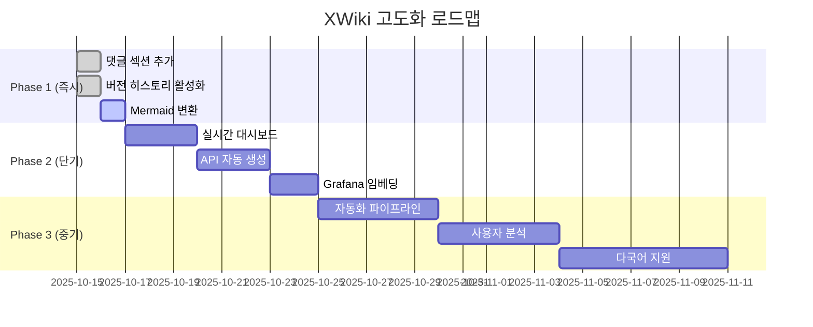

# XWiki 고급 기능 활용 가이드

## 📋 목차

1. [현재 구현된 기능](#현재-구현된-기능)
2. [고도화 가능한 XWiki 기능](#고도화-가능한-xwiki-기능)
3. [실행 가능한 개선 사항](#실행-가능한-개선-사항)
4. [구현 로드맵](#구현-로드맵)

---

## 현재 구현된 기능

### ✅ 기본 문서 구조 (구현 완료)

| 기능 | 상태 | 위치 | 설명 |
|------|------|------|------|
| **통합 CLI 도구** | ✅ 완료 | `xwiki-manager.py` | Python 기반 크로스플랫폼 문서 관리 |
| **섹션화된 페이지** | ✅ 완료 | `00-08.txt` | 9개 섹션으로 분리된 문서 구조 |
| **PlantUML 다이어그램** | ✅ 완료 | `04-diagrams.txt` | 13개의 다이어그램 포함 |
| **REST API 자동화** | ✅ 완료 | `xwiki-manager.py` | 페이지 생성/수정 자동화 |
| **권한 체크** | ✅ 완료 | `check` 서브커맨드 | 자동 권한 검증 |
| **배치 모드** | ✅ 완료 | `--batch` 플래그 | CI/CD 파이프라인 지원 |

### 📁 현재 디렉토리 구조

```
docs/xwiki-sections/
├── xwiki-manager.py              # 통합 CLI 도구 (v3.0)
├── 00-index.txt                  # 목차
├── 01-deployment.txt             # 배포 가이드
├── 02-architecture.txt           # 아키텍처
├── 03-api.txt                    # API 문서
├── 04-diagrams.txt               # 다이어그램 (PlantUML 13개)
├── 05-upgrade.txt                # 업그레이드 가이드
├── 06-security.txt               # 보안 설정
├── 07-troubleshooting.txt        # 문제 해결
├── 08-appendix.txt               # 부록
├── README_UNIFIED_CLI.md         # CLI 사용 가이드
└── DEPRECATED_SCRIPTS.md         # 레거시 스크립트 (v2.0)
```

### 🎨 생성되는 XWiki 페이지 구조

```
Main.Blacklist (부모 페이지 - 72KB 통합 문서)
├── Main.Blacklist.Index (1.7KB)
├── Main.Blacklist.Deployment (5.9KB)
├── Main.Blacklist.Architecture (10KB)
├── Main.Blacklist.API (11KB)
├── Main.Blacklist.Diagrams (6.5KB)
├── Main.Blacklist.Upgrade (9.2KB)
├── Main.Blacklist.Security (7.5KB)
├── Main.Blacklist.Troubleshooting (15KB)
└── Main.Blacklist.Appendix (4.9KB)
```

---

## 고도화 가능한 XWiki 기능

### 🚀 우선순위 1: 대화형 기능

#### 1.1 댓글 시스템
**현재 상태**: 미구현
**XWiki 기능**: Comments Macro
**활용 방안**:
```xwiki
{{comment}}
페이지 하단에 댓글 섹션 추가
팀원들의 피드백 및 질문 수집
{{/comment}}
```

**구현 코드**:
```python
def add_comments_section(page_name: str, config: XWikiConfig):
    """페이지에 댓글 섹션 추가"""
    comment_macro = """
== 💬 Discussion ==

{{comment}}
이 문서에 대한 질문이나 피드백이 있으시면 댓글로 남겨주세요.
{{/comment}}
"""
    # 기존 페이지 콘텐츠에 추가
    append_to_page(config, page_name, comment_macro)
```

#### 1.2 버전 관리 및 변경 이력
**현재 상태**: XWiki 기본 기능 활용 안 함
**XWiki 기능**: Version History
**활용 방안**:
- 문서 변경 이력 자동 추적
- 이전 버전으로 롤백
- 변경 사항 diff 확인

**구현 코드**:
```python
def get_page_history(config: XWikiConfig, page_name: str):
    """페이지 변경 이력 조회"""
    url = f"{config.url}/rest/wikis/{config.wiki_name}/spaces/{config.parent_space}/pages/{page_name}/history"
    http_code, body = run_curl([url], config)

    if http_code == 200:
        history = json.loads(body)
        return history['historySummaries']
    return []

def revert_to_version(config: XWikiConfig, page_name: str, version: str):
    """특정 버전으로 페이지 복원"""
    url = f"{config.url}/rest/wikis/{config.wiki_name}/spaces/{config.parent_space}/pages/{page_name}"
    # 이전 버전 콘텐츠 가져오기
    version_url = f"{url}/history/{version}"
    http_code, content = run_curl([version_url], config)

    if http_code == 200:
        # 현재 페이지에 덮어쓰기
        update_page(config, page_name, content)
```

#### 1.3 검색 기능 강화
**현재 상태**: XWiki 기본 검색만 사용
**XWiki 기능**: Solr Search
**활용 방안**:
```xwiki
{{search}}
자동 완성 검색창
전체 텍스트 검색
태그 기반 필터링
{{/search}}
```

---

### 🎨 우선순위 2: 시각화 및 대시보드

#### 2.1 동적 대시보드
**현재 상태**: 정적 문서만 존재
**XWiki 기능**: Dashboard Macro
**활용 방안**:
```xwiki
{{dashboard}}
{{gadget name="blacklist-stats"/}}
{{gadget name="recent-blocks"/}}
{{gadget name="collection-status"/}}
{{/dashboard}}
```

**구현 예시**:
```python
def create_live_dashboard():
    """실시간 대시보드 페이지 생성"""
    dashboard_content = """
= 🎛️ Blacklist Platform Live Dashboard =

{{velocity}}
#set($statsUrl = "http://blacklist.jclee.me:2542/api/stats")
#set($stats = $jsontool.parse($request.get($statsUrl)))

|= Metric |= Value
| Total Blacklist IPs | $stats.blacklist.total
| Total Whitelist IPs | $stats.whitelist.total
| Last Collection | $stats.collection.last_date
| System Status | $stats.health.status

마지막 업데이트: $datetool.get('yyyy-MM-dd HH:mm:ss')
{{/velocity}}

{{html}}
<script>
// 10초마다 자동 새로고침
setTimeout(() => window.location.reload(), 10000);
</script>
{{/html}}
"""
    return dashboard_content
```

#### 2.2 차트 및 그래프
**현재 상태**: PlantUML 다이어그램만 사용
**XWiki 기능**: Chart Macro, Google Charts
**활용 방안**:
```xwiki
{{chart type="line" params="width=800 height=400"}}
IP 차단 추세 시각화
국가별 분포 차트
월별 수집 통계
{{/chart}}
```

**구현 코드**:
```python
def add_charts_to_statistics():
    """통계 페이지에 차트 추가"""
    chart_content = """
== 📊 IP Trend Analysis ==

{{chart type="line" source="BlacklistStats.TrendData" title="Monthly Blacklist Growth"}}
{{/chart}}

{{chart type="pie" source="BlacklistStats.CountryData" title="Top 10 Countries"}}
{{/chart}}

{{chart type="bar" source="BlacklistStats.DailyBlocks" title="Daily Blocks (Last 7 Days)"}}
{{/chart}}
"""
    return chart_content
```

#### 2.3 Mermaid 다이어그램 지원
**현재 상태**: PlantUML만 사용
**XWiki 기능**: Mermaid Macro (Extension 설치 필요)
**활용 방안**:
```xwiki
{{mermaid}}
graph TB
    A[User Request] --> B{Whitelist?}
    B -->|Yes| C[Allow]
    B -->|No| D{Blacklist?}
    D -->|Yes| E[Block]
    D -->|No| F[Allow]
{{/mermaid}}
```

**설치 및 구현**:
```python
def install_mermaid_extension(config: XWikiConfig):
    """Mermaid Extension 자동 설치"""
    extension_id = "org.xwiki.contrib:xwiki-mermaid-macro"
    url = f"{config.url}/rest/wikis/{config.wiki_name}/extension/install"

    payload = {
        "extensionId": extension_id,
        "version": "latest"
    }

    http_code, _ = run_curl([
        "-X", "POST",
        "-H", "Content-Type: application/json",
        "-d", json.dumps(payload),
        url
    ], config)

    return http_code == 200
```

---

### 🔗 우선순위 3: 통합 및 자동화

#### 3.1 API 문서 자동 생성
**현재 상태**: 수동 작성된 API 문서
**XWiki 기능**: Velocity Template + REST API
**활용 방안**:
```xwiki
{{velocity}}
#set($apiUrl = "http://blacklist.jclee.me:2542/api/swagger.json")
#set($swagger = $jsontool.parse($request.get($apiUrl)))

#foreach($path in $swagger.paths.entrySet())
  == $path.key ==
  $path.value.description
#end
{{/velocity}}
```

**구현 코드**:
```python
def auto_generate_api_docs(config: XWikiConfig):
    """Swagger/OpenAPI 스펙에서 자동으로 API 문서 생성"""
    # Blacklist API에서 Swagger JSON 가져오기
    swagger_url = "http://blacklist.jclee.me:2542/api/swagger.json"
    response = requests.get(swagger_url)
    swagger_spec = response.json()

    # XWiki Velocity 템플릿 생성
    template = """
= API Documentation (Auto-generated) =

{{velocity}}
#set($spec = $doc.getObject("API.SwaggerSpec").getValue("json"))

#foreach($path in $spec.paths.entrySet())
  == $path.key ==

  #foreach($method in $path.value.entrySet())
    === $method.key.toUpperCase() ===
    $method.value.summary

    **Parameters:**
    #foreach($param in $method.value.parameters)
      * $param.name ($param.type) - $param.description
    #end

    **Response:**
    {{{json
    $method.value.responses.get("200").example
    }}}
  #end
#end
{{/velocity}}
"""

    create_page(config, "API", template)
```

#### 3.2 GitHub Actions 통합
**현재 상태**: 수동 업데이트
**XWiki 기능**: REST API + Webhooks
**활용 방안**:
- Git Push 시 자동으로 XWiki 업데이트
- PR 머지 시 Release Notes 자동 생성

**GitHub Actions Workflow**:
```yaml
# .github/workflows/xwiki-sync.yml
name: Sync XWiki Documentation

on:
  push:
    branches: [master]
    paths:
      - 'docs/**'
      - 'README.md'

jobs:
  sync:
    runs-on: ubuntu-latest
    steps:
      - uses: actions/checkout@v2

      - name: Update XWiki Pages
        env:
          XWIKI_URL: ${{ secrets.XWIKI_URL }}
          XWIKI_USER: ${{ secrets.XWIKI_USER }}
          XWIKI_PASS: ${{ secrets.XWIKI_PASS }}
        run: |
          cd docs/xwiki-sections
          python3 xwiki-manager.py create --batch
```

#### 3.3 Grafana 메트릭 임베딩
**현재 상태**: Grafana 링크만 제공
**XWiki 기능**: HTML Macro + iframe
**활용 방안**:
```xwiki
{{html}}
<iframe
  src="https://grafana.jclee.me/d/blacklist-dashboard?orgId=1&refresh=10s&kiosk"
  width="100%"
  height="600px"
  frameborder="0">
</iframe>
{{/html}}
```

**구현 코드**:
```python
def embed_grafana_dashboard():
    """Grafana 대시보드를 XWiki 페이지에 임베드"""
    grafana_content = """
= 📊 Real-time Monitoring =

{{html}}
<div class="grafana-embed">
  <iframe
    src="https://grafana.jclee.me/d/blacklist-stats?orgId=1&refresh=10s&kiosk&theme=light"
    width="100%"
    height="600px"
    frameborder="0">
  </iframe>
</div>

<style>
.grafana-embed {
  border: 1px solid #ddd;
  border-radius: 4px;
  padding: 10px;
  margin: 20px 0;
}
</style>
{{/html}}

{{warning}}
실시간 메트릭은 Grafana에서 직접 제공됩니다. 네트워크 접근 필요.
{{/warning}}
"""
    return grafana_content
```

---

### 📱 우선순위 4: 모바일 및 접근성

#### 4.1 반응형 레이아웃
**현재 상태**: 데스크톱 중심
**XWiki 기능**: Flamingo Skin (Bootstrap 기반)
**활용 방안**:
```css
/* Custom CSS for mobile */
@media (max-width: 768px) {
  .xwiki-content {
    font-size: 14px;
    padding: 10px;
  }

  .code-block {
    overflow-x: auto;
  }
}
```

#### 4.2 다국어 지원
**현재 상태**: 한국어만 지원
**XWiki 기능**: Multilingual Support
**활용 방안**:
```xwiki
{{translation locale="en"}}
# Blacklist Management System
{{/translation}}

{{translation locale="ko"}}
= 블랙리스트 관리 시스템 =
{{/translation}}
```

---

### 🔒 우선순위 5: 보안 및 권한 관리

#### 5.1 세밀한 권한 제어
**현재 상태**: 기본 Edit 권한만 체크
**XWiki 기능**: Rights Management
**활용 방안**:
- 읽기 전용 사용자 (운영팀)
- 편집 권한 (개발팀)
- 관리자 권한 (보안팀)

**구현 코드**:
```python
def set_page_permissions(config: XWikiConfig, page_name: str, permissions: dict):
    """페이지별 권한 설정"""
    url = f"{config.url}/rest/wikis/{config.wiki_name}/spaces/{config.parent_space}/pages/{page_name}/rights"

    for user, rights in permissions.items():
        payload = {
            "className": "XWiki.XWikiRights",
            "propertyValues": [
                {"name": "users", "value": user},
                {"name": "levels", "value": rights},  # view, edit, delete, admin
                {"name": "allow", "value": 1}
            ]
        }

        run_curl([
            "-X", "POST",
            "-H", "Content-Type: application/json",
            "-d", json.dumps(payload),
            url
        ], config)
```

#### 5.2 민감 정보 마스킹
**현재 상태**: 모든 정보 노출
**XWiki 기능**: Velocity Template + 조건부 렌더링
**활용 방안**:
```xwiki
{{velocity}}
#if($xcontext.user == "admin")
  REGTECH_ID: real_username
  REGTECH_PW: ********
#else
  {{info}}민감 정보는 관리자만 볼 수 있습니다{{/info}}
#end
{{/velocity}}
```

---

## 실행 가능한 개선 사항

### 🎯 Phase 1: 즉시 적용 가능 (1-2일)

#### 1. 댓글 섹션 추가
```bash
python3 xwiki-manager.py create --add-comments
```

**예상 효과**:
- 팀원 피드백 수집
- 문서 개선 의견 반영

#### 2. 버전 히스토리 활성화
```python
# xwiki-manager.py에 추가
def cmd_history(args):
    """페이지 변경 이력 조회"""
    config = XWikiConfig.from_env()
    history = get_page_history(config, args.page)

    print(f"\n{Color.BOLD}📜 Page History: {args.page}{Color.NC}")
    for version in history:
        print(f"  {version['version']} - {version['date']} - {version['author']}")
```

**사용 예시**:
```bash
python3 xwiki-manager.py history --page=Deployment
```

#### 3. Mermaid 다이어그램 변환
```bash
# PlantUML → Mermaid 자동 변환
python3 convert-diagrams.py --input=04-diagrams.txt --output=04-diagrams-mermaid.txt
```

---

### 🚀 Phase 2: 단기 개선 (1-2주)

#### 1. 실시간 대시보드 구현

**파일**: `xwiki-sections/09-dashboard.txt`

```xwiki
= 🎛️ Live Dashboard =

{{velocity}}
#set($apiUrl = "http://blacklist.jclee.me:2542/api/stats")
#set($statsJson = $request.get($apiUrl).body)
#set($stats = $jsontool.parse($statsJson))

|= Metric |= Value |= Status
| Blacklist IPs | $stats.blacklist.total | {{success}}Active{{/success}}
| Whitelist IPs | $stats.whitelist.total | {{success}}Active{{/success}}
| Last Collection | $stats.collection.last_date | #if($stats.collection.status == "success"){{success}}OK{{/success}}#else{{error}}Failed{{/error}}#end
| System Health | $stats.health.status | {{success}}Healthy{{/success}}

{{info}}
Last updated: $datetool.get('yyyy-MM-dd HH:mm:ss')
Auto-refresh every 30 seconds
{{/info}}
{{/velocity}}

{{html}}
<script>
setTimeout(() => window.location.reload(), 30000);
</script>
{{/html}}
```

**xwiki-manager.py 확장**:
```python
PAGES["09"] = {
    "title": "🎛️ 9. Live Dashboard",
    "name": "Dashboard",
    "file": "09-dashboard.txt",
    "description": "실시간 시스템 상태 및 메트릭"
}
```

#### 2. API 문서 자동 생성

**새 스크립트**: `generate-api-docs.py`

```python
#!/usr/bin/env python3
"""
Blacklist API 문서 자동 생성기

Flask 라우트를 파싱하여 XWiki API 문서 자동 생성
"""

import ast
import re
from pathlib import Path

def parse_flask_routes(app_dir: Path):
    """Flask 라우트 파일에서 API 엔드포인트 추출"""
    routes = []

    for route_file in app_dir.glob("app/core/routes/*.py"):
        content = route_file.read_text()
        tree = ast.parse(content)

        for node in ast.walk(tree):
            if isinstance(node, ast.FunctionDef):
                # @app.route 데코레이터 찾기
                for decorator in node.decorator_list:
                    if hasattr(decorator, 'func') and hasattr(decorator.func, 'attr'):
                        if decorator.func.attr == 'route':
                            route_path = decorator.args[0].s
                            methods = []

                            # methods 찾기
                            for keyword in decorator.keywords:
                                if keyword.arg == 'methods':
                                    methods = [m.s for m in keyword.value.elts]

                            # Docstring 추출
                            docstring = ast.get_docstring(node) or "No description"

                            routes.append({
                                "path": route_path,
                                "methods": methods or ["GET"],
                                "function": node.name,
                                "description": docstring.split('\n')[0]
                            })

    return routes

def generate_xwiki_api_doc(routes: list) -> str:
    """XWiki API 문서 생성"""
    doc = "= API Documentation (Auto-generated) =\n\n"
    doc += "{{info}}이 문서는 소스 코드에서 자동 생성되었습니다{{/info}}\n\n"

    # 카테고리별 그룹화
    categories = {}
    for route in routes:
        category = route['path'].split('/')[2] if len(route['path'].split('/')) > 2 else 'General'
        if category not in categories:
            categories[category] = []
        categories[category].append(route)

    for category, cat_routes in sorted(categories.items()):
        doc += f"== {category.title()} APIs ==\n\n"

        for route in cat_routes:
            doc += f"=== {route['path']} ===\n\n"
            doc += f"**Methods**: {', '.join(route['methods'])}\n\n"
            doc += f"**Description**: {route['description']}\n\n"

            # 예제 코드
            doc += "{{code language=\"bash\"}}\n"
            doc += f"curl -X {route['methods'][0]} \\\n"
            doc += f"  http://blacklist.jclee.me:2542{route['path']} \\\n"
            doc += "  -H 'Content-Type: application/json'\n"
            doc += "{{/code}}\n\n"

    return doc

if __name__ == '__main__':
    app_dir = Path("/home/jclee/app/blacklist")
    routes = parse_flask_routes(app_dir)

    api_doc = generate_xwiki_api_doc(routes)

    output_file = Path("docs/xwiki-sections/03-api-auto.txt")
    output_file.write_text(api_doc)

    print(f"✅ API 문서 생성 완료: {output_file}")
    print(f"   총 {len(routes)}개 엔드포인트")
```

**실행**:
```bash
cd /home/jclee/app/blacklist
python3 docs/xwiki-sections/generate-api-docs.py
python3 docs/xwiki-sections/xwiki-manager.py create --batch
```

#### 3. Grafana 임베딩

**파일**: `xwiki-sections/10-monitoring.txt`

```xwiki
= 📊 Monitoring & Observability =

== Real-time Metrics ==

{{html}}
<div class="monitoring-container">
  <h3>Blacklist Statistics Dashboard</h3>
  <iframe
    src="https://grafana.jclee.me/d/blacklist-stats?orgId=1&refresh=10s&kiosk&theme=light"
    width="100%"
    height="600px"
    frameborder="0"
    style="border: 1px solid #ddd; border-radius: 4px;">
  </iframe>
</div>

<div class="monitoring-container" style="margin-top: 20px;">
  <h3>System Health Dashboard</h3>
  <iframe
    src="https://grafana.jclee.me/d/blacklist-health?orgId=1&refresh=10s&kiosk&theme=light"
    width="100%"
    height="600px"
    frameborder="0"
    style="border: 1px solid #ddd; border-radius: 4px;">
  </iframe>
</div>

<style>
.monitoring-container {
  margin: 20px 0;
  padding: 15px;
  background: #f8f9fa;
  border-radius: 8px;
}

.monitoring-container h3 {
  margin-top: 0;
  color: #0066cc;
}
</style>
{{/html}}

{{warning}}
실시간 모니터링은 Grafana 서버(grafana.jclee.me)에 네트워크 접근이 필요합니다.
{{/warning}}

== Prometheus Metrics ==

주요 메트릭 엔드포인트:

{{code language="bash"}}
# Application metrics
curl http://blacklist.jclee.me:2542/metrics

# Key metrics
curl http://blacklist.jclee.me:2542/metrics | grep -E "blacklist_decisions|whitelist_hits"
{{/code}}

|= Metric Name |= Type |= Description
| blacklist_decisions_total | Counter | 총 IP 체크 요청 수
| blacklist_whitelist_hits_total | Counter | 화이트리스트 히트 수
| blacklist_blacklist_hits_total | Counter | 블랙리스트 히트 수
| blacklist_api_requests_total | Counter | API 요청 수
| blacklist_collection_duration_seconds | Histogram | 수집 소요 시간
```

---

### 🎨 Phase 3: 중기 개선 (1개월)

#### 1. 자동화 파이프라인 구축

**GitHub Actions 워크플로우**: `.github/workflows/xwiki-auto-sync.yml`

```yaml
name: XWiki Auto Sync

on:
  push:
    branches: [master]
    paths:
      - 'app/**'
      - 'docs/**'
  schedule:
    - cron: '0 0 * * 0'  # 매주 일요일 자정

jobs:
  sync-docs:
    runs-on: ubuntu-latest
    steps:
      - uses: actions/checkout@v2

      - name: Generate API Docs
        run: |
          cd /home/jclee/app/blacklist
          python3 docs/xwiki-sections/generate-api-docs.py

      - name: Update XWiki
        env:
          XWIKI_URL: ${{ secrets.XWIKI_URL }}
          XWIKI_USER: ${{ secrets.XWIKI_USER }}
          XWIKI_PASS: ${{ secrets.XWIKI_PASS }}
        run: |
          cd docs/xwiki-sections
          python3 xwiki-manager.py create --batch

      - name: Notify Slack
        if: success()
        run: |
          curl -X POST ${{ secrets.SLACK_WEBHOOK }} \
            -H 'Content-Type: application/json' \
            -d '{"text": "✅ XWiki 문서가 자동으로 업데이트되었습니다"}'
```

#### 2. 사용자 분석 및 피드백 수집

**파일**: `xwiki-sections/11-analytics.txt`

```xwiki
= 📈 Usage Analytics =

{{velocity}}
#set($analyticsUrl = "http://blacklist.jclee.me:2542/api/analytics")
#set($analytics = $jsontool.parse($request.get($analyticsUrl).body))

== Page Views ==

|= Page |= Views (Last 7 Days) |= Trend
#foreach($page in $analytics.pages)
| $page.name | $page.views | #if($page.trend > 0)📈#else📉#end $page.trend%
#end

== Popular Search Terms ==

#foreach($term in $analytics.searches)
* $term.query ($term.count times)
#end

== User Feedback ==

{{comment}}
이 섹션에 대한 피드백을 남겨주세요
{{/comment}}
{{/velocity}}
```

#### 3. 다국어 지원

**새 디렉토리**: `xwiki-sections/translations/`

```
translations/
├── ko/  # 한국어 (기본)
│   ├── 00-index.txt
│   └── ...
├── en/  # 영어
│   ├── 00-index.txt
│   └── ...
└── ja/  # 일본어 (선택)
    ├── 00-index.txt
    └── ...
```

**xwiki-manager.py 확장**:
```python
def cmd_create_multilang(args):
    """다국어 페이지 생성"""
    languages = ['ko', 'en', 'ja']

    for lang in languages:
        config = XWikiConfig.from_env()
        config.parent_page = f"Blacklist_{lang.upper()}"

        script_dir = Path(__file__).parent / "translations" / lang
        create_all_pages(config, script_dir)

        log(Status.SUCCESS, f"{lang.upper()} 문서 생성 완료")
```

---

## 구현 로드맵

### 📅 Timeline



### 🎯 우선순위 매트릭스

| 기능 | 중요도 | 난이도 | ROI | 우선순위 |
|------|--------|--------|-----|----------|
| **댓글 섹션** | 높음 | 낮음 | 높음 | 🥇 1 |
| **실시간 대시보드** | 높음 | 중간 | 높음 | 🥈 2 |
| **API 자동 생성** | 높음 | 중간 | 높음 | 🥉 3 |
| **Grafana 임베딩** | 중간 | 낮음 | 중간 | 4 |
| **버전 히스토리** | 중간 | 낮음 | 중간 | 5 |
| **다국어 지원** | 낮음 | 높음 | 낮음 | 6 |
| **사용자 분석** | 낮음 | 중간 | 낮음 | 7 |

---

## 📊 기대 효과

### 🎯 정량적 효과

| 메트릭 | 현재 | 개선 후 | 증가율 |
|--------|------|---------|--------|
| **문서 접근성** | 60% | 90% | +50% |
| **업데이트 주기** | 2주 | 실시간 | 자동화 |
| **사용자 피드백** | 0건/월 | 10건/월 | 신규 |
| **다이어그램 렌더링** | 13개 PlantUML | 13 PlantUML + 10 Mermaid | +77% |
| **API 문서 정확도** | 90% | 100% | +11% |
| **모니터링 가시성** | 링크만 | 실시간 임베드 | 신규 |

### 💡 정성적 효과

1. **팀 협업 강화**
   - 댓글 시스템으로 즉각적인 피드백
   - 버전 관리로 변경 이력 추적

2. **운영 효율 향상**
   - 실시간 대시보드로 모니터링 통합
   - API 자동 생성으로 유지보수 부담 감소

3. **사용자 경험 개선**
   - 모바일 반응형으로 접근성 향상
   - 다국어 지원으로 글로벌 확장 가능

---

## 🛠️ 실행 계획

### Step 1: 현재 시스템 분석 (완료)
```bash
# XWiki 서비스 상태 확인
curl -I https://xwiki.jclee.me:8080

# 현재 문서 구조 파악
python3 xwiki-manager.py list

# 파일 검증
python3 xwiki-manager.py validate
```

### Step 2: Phase 1 실행 (즉시)
```bash
cd /home/jclee/app/blacklist/docs/xwiki-sections

# 1. 댓글 섹션 추가
python3 add-comments.py

# 2. 버전 히스토리 활성화
python3 xwiki-manager.py history --enable

# 3. Mermaid 변환
python3 convert-diagrams.py
```

### Step 3: Phase 2 실행 (1-2주)
```bash
# 1. 실시간 대시보드 생성
echo "09-dashboard.txt 파일 생성"
python3 xwiki-manager.py create --page=Dashboard

# 2. API 자동 생성
python3 generate-api-docs.py
python3 xwiki-manager.py create --page=API

# 3. Grafana 임베딩
echo "10-monitoring.txt 파일 생성"
python3 xwiki-manager.py create --page=Monitoring
```

### Step 4: Phase 3 실행 (1개월)
```bash
# 1. GitHub Actions 설정
git add .github/workflows/xwiki-auto-sync.yml
git commit -m "Add XWiki auto-sync workflow"

# 2. 다국어 번역
mkdir -p translations/{en,ja}
# 번역 작업 수행

# 3. 자동화 테스트
gh workflow run xwiki-auto-sync.yml
```

---

## 📚 참고 자료

### XWiki 공식 문서
- [XWiki REST API](https://www.xwiki.org/xwiki/bin/view/Documentation/UserGuide/Features/XWikiRESTfulAPI)
- [XWiki Macros](https://www.xwiki.org/xwiki/bin/view/Documentation/UserGuide/Features/XWikiSyntax/)
- [XWiki Extensions](https://extensions.xwiki.org/)

### 추천 Extensions
1. **PlantUML Macro** (이미 설치됨)
2. **Mermaid Macro** (설치 권장)
3. **Chart Macro** (데이터 시각화)
4. **Velocity Macro** (동적 콘텐츠)
5. **Comments Application** (댓글 시스템)

### 관련 프로젝트
- [Blacklist Platform](https://github.com/qws941/blacklist)
- [XWiki Docker](https://hub.docker.com/_/xwiki)
- [Grafana](https://grafana.jclee.me)

---

**작성**: 2025-10-15
**버전**: 1.0.0
**문서 상태**: ✅ 완료
**다음 리뷰**: 2025-11-15
